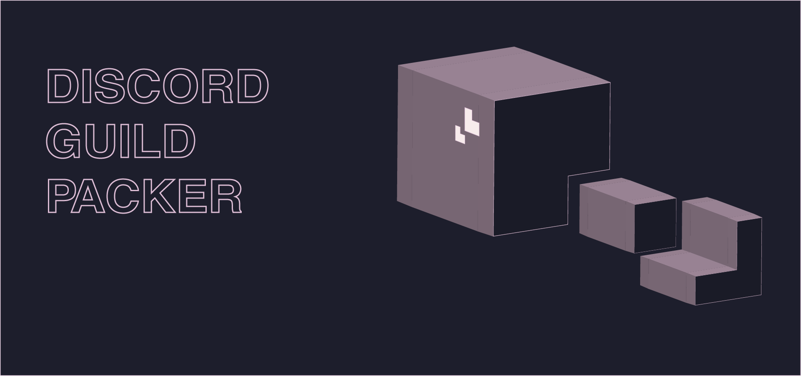

> [!IMPORTANT]  
> The project is currently under development

# Discord Guild Pack

A program to expand the capabilities of guild packaging in Discord. The standard functionality of Discord does not allow you to create a template for everything at once, and this is an excellent alternative for those who develop servers.

## Todo

 - [ ] Package Format
    - [ ] Guild name
    - [ ] Guild avatar
    - [ ] Guild inactive channel
        - [ ] Timeout
    - [ ] Channels
        - [ ] Permissions
        - [ ] Name
        - [ ] Description
        - [ ] Slow-mode
        - [ ] Age-Restricted (true/false)
        - [ ] IsAnnouncement Channel
        - [ ] Type of Channel
        - [ ] Hide after inactivity
        - [ ] Parent Category
    - [ ] Roles
        - [ ] Name
        - [ ] Color
        - [ ] Icon (if guild boosted)
        - [ ] Default Settings (like display role member separately from online members)
        - [ ] Permissions
        - [ ] Position
    - [ ] Emoji
        - [ ] Name
        - [ ] Image/GIF
    - [ ] Stickers
        - [ ] Name
        - [ ] Image/GIF
        - [ ] Related Emoji
        - [ ] Description
    - [ ] Soundboard
        - [ ] Emoji
        - [ ] Name
        